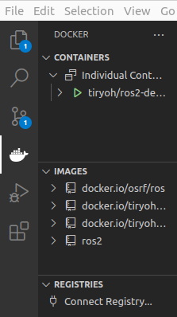

# Docker Installation

Doing a Docker installation is a great method for setting up the repository on any operating system
that isn't Ubuntu 22.04. It is a faster and more lightweight alternative to a traditional Virtual Machine.
In addition, you can run GUI applications like Gazebo using the NoVNC desktop environment.

## 1. Install Docker

[Windows Instructions](https://docs.docker.com/desktop/windows/install/)

[Mac Instructions](https://docs.docker.com/desktop/mac/install/)

[Ubuntu Instructions](https://docs.docker.com/engine/install/ubuntu/)

### NOTE
* If you are on Linux, add yourself to the `docker` group. Being a member of the `docker` group allows you to run `docker` without `sudo`.
```bash
sudo groupadd docker
sudo usermod -aG docker $USER
```

After you complete the installation, **restart your computer**!

To check that everything installed OK, you should be able to open the command line and type:
```bash
docker
```

## 2. Install VS Code (Highly Recommended)

You do not have to use VS Code. However, VS Code has very nice extensions for using Docker containers.

[Download VS Code here](https://code.visualstudio.com/Download)

### 2a. Install VS Code Extensions

Search for and install the following extensions in VS Code

* Docker
* ROS
* C/C++
* CMake

## 3. Install Git

[Install Git using the instructions here](https://git-scm.com/book/en/v2/Getting-Started-Installing-Git)

## 4. Obtain Docker Image

You can either pull the image from Dockerhub or build the image manually using a Dockerfile. 
**Pulling from Dockerhub is faster, easier, and less error-prone**. However, if you want to 
edit the Dockerfile for some reason, do the manual build instructions.

-   ### Pull From Dockerhub (Recommended!)

```bash
docker pull robojackets/urc-gui-baseimage
```

-   ### [Manually Build Docker Image](manual_docker_image.md)

## 5. Create directory to mount container

The docker container is essentially a self-contained instance of Ubuntu 22.04, but can access some files on your system in a limited way. We use this so the container can see the repositories you clone locally, that way both local development and containerized testing can be done without any delays.

**You can place this directory wherever you want**, I recommend `/home` for Mac/Linux and `C:\Users\[Username]\` for Windows

```bash
mkdir urc_container
```

## 6. [Download our installation script](../../setup.sh)

Our installation script will
- Clone all necessary repos
- Automatically setup your desktop NoVNC environment

## 7. Move the script into your `urc_container` directory

## 8. Run the script

```bash
chmod +x setup.sh
```

```bash
./setup.sh
```

## 9. Access your new container

For beginners to Docker:
- Go to `localhost:6060` in your web browser of choice

Recommended way:
- Open up VS Code
- Click on the whale Docker icon on your left
- Right click the currently running container (Should be called tiryoh/ros2)
- Select open in browser



## 10. Head to your mounted directory

Open terminator in the desktop (this is the recommended terminal for commands in your container)


In terminator, run
```bash
cd urc_container
```

## 11. Build!

First, it's always a good idea to check for updates. Nothing will happen if you just created the image. However, if you decide to re-create the container a while after you made the initial image, you will need to update those packages.

```bash
sudo apt update
sudo apt upgrade
cd /colcon_ws
rosdep update
```

Now, it's time for the moment of truth!

``` bash
cd /colcon_ws
colcon build
```

## 12. Developing using the Docker NoVNC container

1. Work on your code in `urc_container` locally to avoid input lag
2. When ready to test, you can build and run your code in the container just like on native Ubuntu!

## 13. Closing/Starting the Container

Once you are done with the conatiner, be sure to close the Docker container. Otherwise, the 
Docker container will take up a big chunk of memory on your computer.

-   ### Using VS Code

    - Go to the Docker tab in VS Code
    - Right click the container (it has a green arrow next to it if already running)
    - Press stop/start

    

-   ### Using the install script

    - Go to where you placed `urc_container` locally
    - Run `./setup.sh stop` to stop
    - Run `./setup.sh start` to start up again