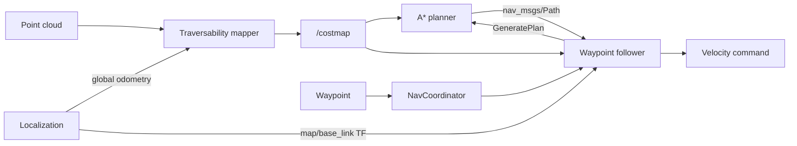

# URC Navigation Architecture

The rover uses a custom ROS 2 navigation stack built around a rolling Grid Map,
an A* planning service, and a waypoint-following action. It is not a Nav2 planner
plugin.

## System flow



The interfaces separate route creation from rover motion:

- `GeneratePlan` takes start and goal poses, runs A*, and returns a
  `nav_msgs/Path`. It does not command the rover.
- `NavigateToWaypoint` accepts either a goal or an existing path. For a goal, the
  follower requests a plan first; it then tracks the path and publishes velocity
  commands.

## Package responsibilities

| Package | Responsibility |
| --- | --- |
| [`urc_localization`](../urc_localization/README.md) | Provides global odometry and the `map`, `odom`, and `base_link` frame relationship |
| [`urc_perception`](../urc_perception/README.md) | Converts terrain point clouds into the rolling `/costmap` Grid Map |
| [`urc_state_machine`](../urc_state_machine/README.md) | Converts pose or GPS waypoint inputs into follower action goals and reports navigation state |
| [`urc_path_planning`](../urc_path_planning/README.md) | Creates cost-weighted A* paths through `GeneratePlan` |
| [`urc_trajectory_following`](../urc_trajectory_following/README.md) | Tracks paths, monitors traversal cost, replans when needed, and publishes velocity commands |
| [`urc_nav_common`](../urc_nav_common/README.md) | Provides shared Grid Map lookup behavior for planning and following |

## Runtime contracts

- Localization must provide a connected `map`-to-`base_link` TF tree. Point
  clouds need a stamped sensor frame that can be transformed into `map`.
- Planner poses, paths, and the costmap use `map` coordinates; request frames are
  not transformed by the planner.
- `/costmap` is `grid_map_msgs/msg/GridMap`; planning and following use its
  `traversability_inflated` layer.
- A goal-based navigation request requires both the `plan` service and
  `navigate_to_waypoint` action server.
- The follower can replan when its tracking point exceeds the configured lethal
  cost. During this collision check, missing cost data is currently treated as
  traversable.
- Velocity topic and message type must match the downstream command-routing or
  controller configuration before operating the rover.

## Launching

For simulation with localization, sensors, controllers, and autonomy:

```bash
ros2 launch urc_bringup sim.launch.py autonomy:=true
```

To start only the autonomy nodes:

```bash
ros2 launch urc_bringup autonomy.launch.py
```

The autonomy-only launch expects localization, point-cloud input, TF, and rover
control to already be running. There is currently no complete physical-rover
bringup launch.
